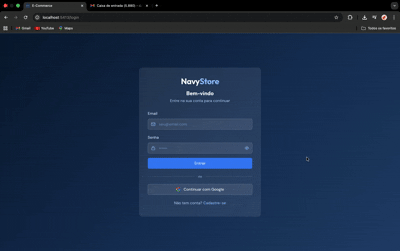
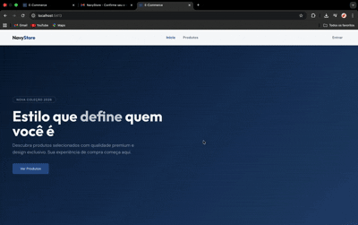
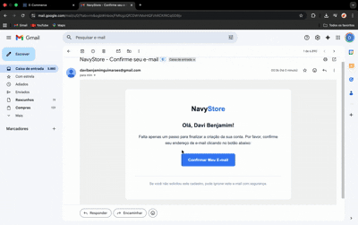

# SpringSecurity

> Projeto em desenvolvimento — novas funcionalidades ainda estão sendo implementadas.

## Sobre o projeto

Aplicação back-end construída com **Spring Boot 4** e **Spring Security**, focada em autenticação, autorização e integração com serviços externos. Atualmente serve como base de autenticação completa com suporte a login local e social (Google).

---

## Demonstração

### Registro de novo usuário
> Criação de conta, envio do e-mail de confirmação e verificação do token.




---

### Login com Google
> Autenticação via OAuth2 com conta Google, sem necessidade de senha.




---

### Confirmação de e-mail e login
> Fluxo completo: recebimento do e-mail, clique no link de confirmação e login na aplicação.




---

## Funcionalidades implementadas

- **Autenticação JWT** — geração e validação de tokens com `spring-oauth2-resource-server`, entregues via cookie `HttpOnly` (proteção contra XSS)
- **Login local** — autenticação com e-mail e senha usando `BCryptPasswordEncoder`
- **Login com Google (OAuth2)** — validação do `accessToken` Google via endpoint `/oauth2/v3/userinfo`
- **Logout** — invalidação do cookie JWT no navegador
- **Cadastro de usuário** — registro público com validação de dados (`spring-validation`)
- **Verificação de e-mail** — envio de token de confirmação por e-mail após o cadastro
- **Reenvio de e-mail de verificação** — reenvio com controle de tempo mínimo entre requisições
- **Perfil de usuário** — modelo com hierarquia (`User` → `ProfiledUser` → `StandardUser`) usando estratégia `JOINED` do JPA
- **Completar perfil** — endpoint para usuários Google completarem nome, CPF e telefone após o primeiro login
- **Inicialização de admin** — endpoint para criação do usuário administrador padrão
- **Templates de e-mail** — e-mails HTML com **Thymeleaf**

---

## Dependências utilizadas

| Dependência | Finalidade |
|---|---|
| `spring-boot-starter-web` | Criação de APIs REST |
| `spring-boot-starter-security` | Autenticação e autorização |
| `spring-boot-starter-oauth2-resource-server` | Validação e geração de tokens JWT |
| `spring-boot-starter-data-jpa` | Persistência com JPA/Hibernate |
| `spring-boot-starter-validation` | Validação de dados de entrada |
| `spring-boot-starter-mail` | Envio de e-mails transacionais |
| `spring-boot-starter-thymeleaf` | Templates HTML para e-mails |
| `mysql-connector-j` | Banco de dados MySQL |
| `google-api-client` | Integração com APIs do Google |
| `lombok` | Redução de boilerplate |

---

## Endpoints disponíveis

### Autenticação — `/api`
| Método | Rota | Descrição | Autenticação |
|---|---|---|---|
| `POST` | `/api/login` | Login com e-mail e senha | Pública |
| `POST` | `/api/login/google` | Login com Google | Pública |
| `POST` | `/api/logout` | Logout (apaga o cookie JWT) | Pública |

### Usuários — `/api/users`
| Método | Rota | Descrição | Autenticação |
|---|---|---|---|
| `POST` | `/api/users/public` | Cadastro de novo usuário | Pública |
| `POST` | `/api/users/public/verify-email` | Verificação do e-mail via token | Pública |
| `POST` | `/api/users/public/resend-verification` | Reenvio do e-mail de verificação | Pública |
| `POST` | `/api/users` | Criação de usuário (admin) | Autenticado |
| `POST` | `/api/users/admin/init` | Inicializa o usuário admin padrão | Autenticado |

---

## Estrutura do projeto

```text
SpringSecurity/
├── springsecurity/
│   ├── src/
│   │   ├── main/
│   │   │   ├── java/tech/buildrun/springsecurity/
│   │   │   │   ├── config/           # Configurações (SecurityConfig, CORS, beans JWT)
│   │   │   │   ├── email/
│   │   │   │   │   ├── models/       # VerificationToken
│   │   │   │   │   ├── repository/   # VerificationTokenRepository
│   │   │   │   │   └── service/      # EmailService (envio com Thymeleaf)
│   │   │   │   └── shared/
│   │   │   │       ├── controllers/  # TokenController, UserController
│   │   │   │       ├── DTO/          # CreateUserDTO, LoginRequest, LoginResponse, etc.
│   │   │   │       ├── enums/        # Role, AuthProvider
│   │   │   │       ├── models/       # User, ProfiledUser, StandardUser
│   │   │   │       ├── repository/   # UserRepository, StandardUserRepository
│   │   │   │       └── service/      # UserService, JwtTokenService, GoogleAuthService
│   │   │   └── resources/
│   │   │       ├── templates/        # Templates Thymeleaf (e-mails HTML)
│   │   │       └── application.properties
│   │   └── test/
│   └── pom.xml
└── README.md
```

---

## Integrações planejadas

- **API da Meta (WhatsApp Business)** — notificações e mensagens transacionais via WhatsApp
- **API de pagamento** — integração com Mercado Pago, Stripe ou similar

---

## Status do projeto

- Autenticação local e social **implementadas**
- Verificação de e-mail **implementada**
- Integrações com **WhatsApp** e **pagamento** ainda serão adicionadas
